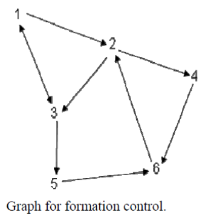

# Multi-Agent Consensus System

## Overview

This repository contains an implementation of a multi-agent consensus system. The system facilitates collaboration among multiple agents to achieve a common heading while maintaining their positions within a defined space.

## Graph Structure

This image illustrates the adjacency matrix representing the connectivity between agents in the multi-agent consensus system.

## Requirements

- MATLAB

## Files

- `consensus_control.m`: Main MATLAB script containing the simulation code.
- `Laplacian.m`: Function to calculate the Laplacian matrix of the graph.

## Usage

1. Ensure you have MATLAB installed on your system.

2. Clone or download this repository to your local machine.

3. Open MATLAB and navigate to the directory where you have saved the files.

4. Run the `consensus_control.m` script.

5. The simulation will execute, and you will see plots displaying the heading angles and positions of all agents over time.

## Simulation Details

- The simulation initializes the velocity, position, and heading of agents.
- It defines an adjacency matrix representing the connectivity between agents.
- The Laplacian matrix of the graph is calculated.
- Using ordinary differential equations (ODE), the simulation continuously updates the states of agents based on their headings, positions, velocity, and Laplacian matrix.

## Plot Interpretation

- The "Heading angles for all nodes" plot displays the evolution of heading angles for all agents over time.
- The "Positions for all nodes" plot shows the trajectories of all agents in the 2D space over time.
